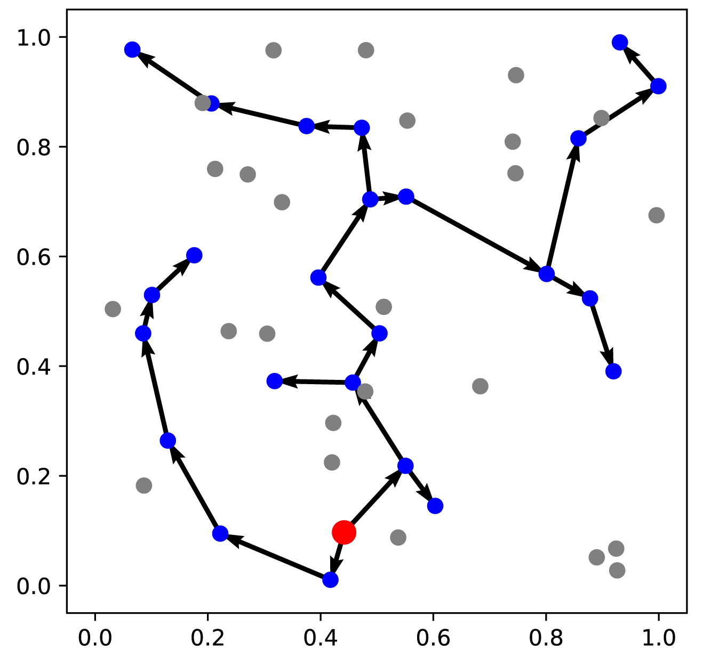

# NeuroPrim

NeuroPrim: an attention-based model for solving three spanning tree problems ([DCMST](https://en.wikipedia.org/wiki/Degree-constrained_spanning_tree), [MRCST](https://en.wikipedia.org/wiki/Minimum_routing_cost_spanning_tree), [STP](https://en.wikipedia.org/wiki/Steiner_tree_problem#Steiner_tree_in_graphs_and_variants)) on Euclidean space


## Dependencies

- Python 3.10
- PyTorch 2.0.1
- TensorBoard 2.10.0
- tqdm 4.65.0
- wandb 0.15.4

## Quick Start

### Training

With the default settings of `--num_batches 2500` and `–-num_epochs 100`, the training of each problem with 20 vertices will take about 10 hours on a single RTX 3090 GPU.

```bash
python generate_data.py --graph_size 20
python train --graph_size 20 --degree_constrain 2
python train --graph_size 20 --cost_function_key mrcst
python train --graph_size 20 --is_stp True
```

### Testing

Run `test.ipynb ` to see the performance of pretrained models on random data.

## Example Solutions

|        DCMST (d=2)         |           MRCST            |          STP           |
| :------------------------: | :------------------------: | :--------------------: |
|  |  |  |

## Acknowledgements

- [wouterkool](https://github.com/wouterkool)/**[attention-learn-to-route](https://github.com/wouterkool/attention-learn-to-route)**: data generation in `generate_data.py`
- [xbresson](https://github.com/xbresson)/**[TSP_Transformer](https://github.com/xbresson/TSP_Transformer)**: network built in `nets/Bresson2021TheTN.py`
- [Transformer — PyTorch](https://pytorch.org/docs/stable/generated/torch.nn.Transformer.html): Transformer used in `nets/transformer.py`
